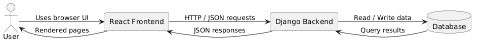
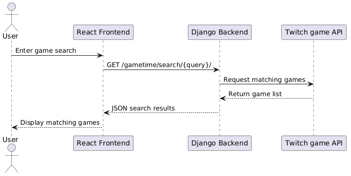

# GameTime Architecture

## 1. Project Overview

GameTime is a game review website with a React and vite as the frontend and a Django backend.  
The site is being built to use multiple pages with elements that will be static across all pages. Users will be able to create and sign into accounts, then leave reviews under those accounts..

The current frontend includes:

- Home page
- Create Account page
- Sign In page
- Account page
- Global Header
- Query Search bar

The backend supporst:

- account creation
- authentication
- search/query functionality
- persistent data storage in a database

---

## 2. High-Level Architecture

