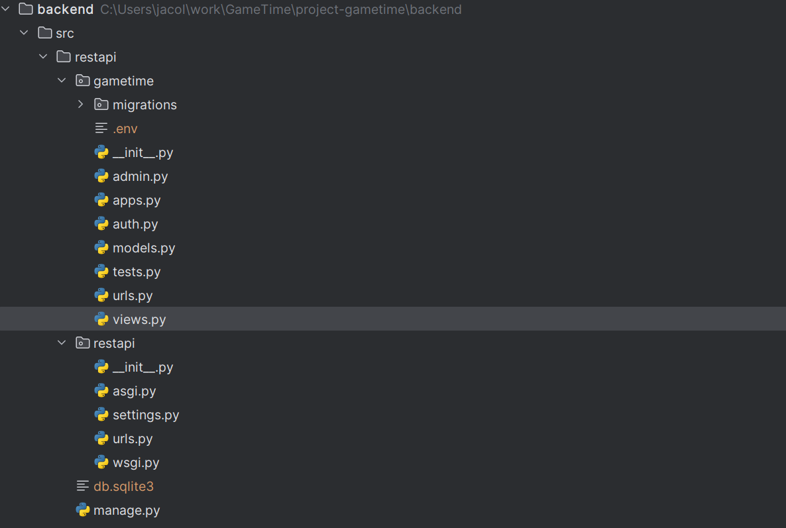
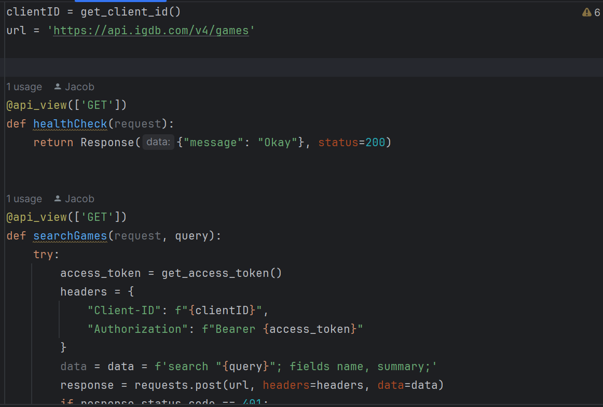
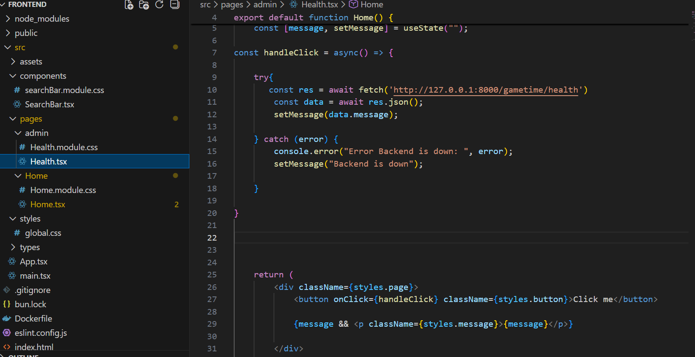

# Sprint Ceremony Minutes

Date: 2026-02-24

members present:

* Jacob Ernst
* Andon Payton
* Michael Verdouw
* Cameron Stevens

## Demo

This sprint, we completed
* simple documentation of django, licences, proposals, and README
* Got a django backend started 
* Got a React project for our frontend started
* Connected the frontend and backend together 

here is a screenshot of what we did:

### Good

* We have a good team that is smart
* We are chill
* We all have good ideas and we work well together

### Bad

* Jacob needs to be more organized and needs to explain things better
* Dividing work between four people is kind of hard
* Installing dependencies between teammates needs to be better

### Actionable Commitments
* As a team we will be better at communicating with each other and have a strong system in place to make sure that all dependencies are easily installable between us. We will also communicate more openly on what tasks need to be done and what each of us are working on.

## Next Sprint Planning
| Points | Story                                                                                        |
|--------|----------------------------------------------------------------------------------------------|
| 6      | As a User, I want to navigate through a huge collection of games                             |
| 7      | As a User I want a Header bar on the website, so I can navigate more freely through the site |
| 7      | As a user, I want to have a search bar implemented                                           |
| 5      | As devs, we want to implement a database so that we can store our data easily                |
