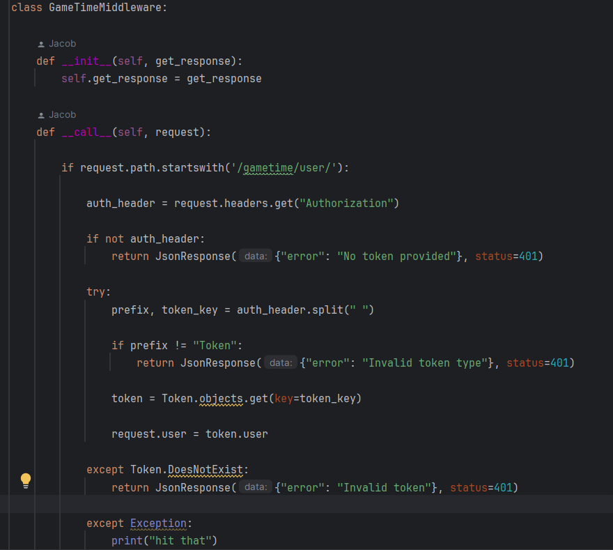
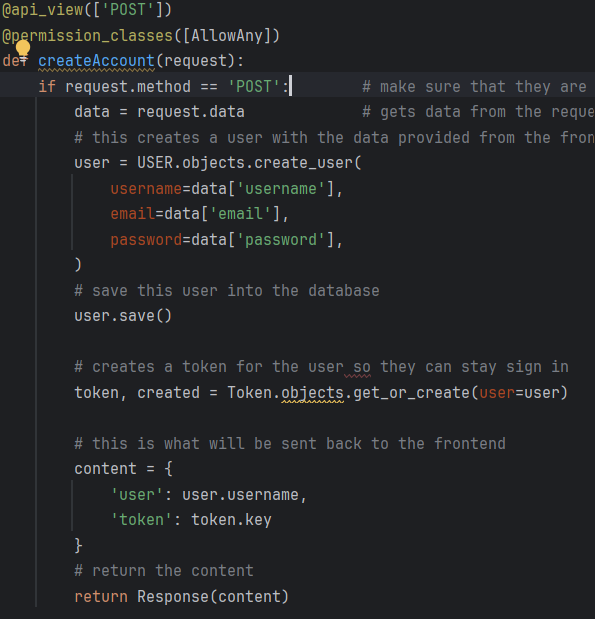
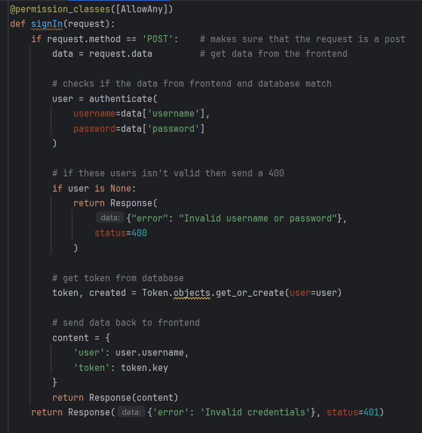

# Sprint Ceremony Minutes
  
Date: 2026-03-26

Members present:

* Jacob Ernst
* Andon Payton
* Michael Verdouw
* Cameron Stevens
  
## Demo

This sprint, we completed:

* Creating users and setting it up with the database
* Allowing the user to sign in 
* Set the account page to where it shows the user that is signed in
* made middleware to check if user is valid on protected routes

Screenshot of our veiws.py and middleware:

## Retro

### Good

* Got alot of work done and see the end near
* Taught the others alot about what goes on under the hood
* Everyone is doing well working together

### Bad

* Teaching others concepts can be hard to do when explained incorrectly
* Middleware took way longer to implement than expected

### Actionable Commitments

* As a team, we will continue to keep working within our realms, and try to get as much work done as we can.
* We are going to focus on making it possible to write a review

## Next Sprint Planning

Points | Story
-------|--------
20     | As a user, I want to be able to make an review
8      | As a user, I want to be able to see my review
8      | As a user, I want to be able to view others reviews
5      | As an admin, I want to test the database with dummy data and queries.
10     | As an admin, I want to tie the reviews to the database.
20     | As a user, I want to be able to login with my Google account using OAuth
